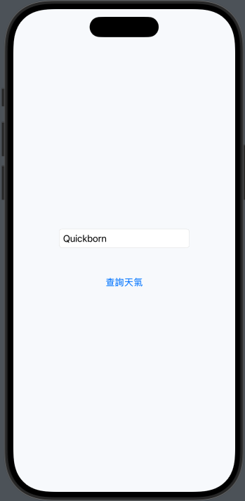
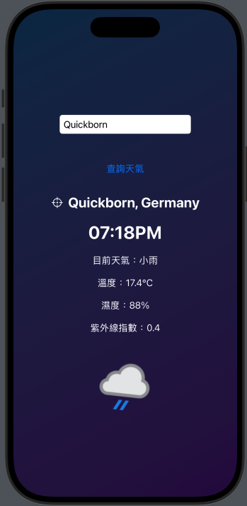
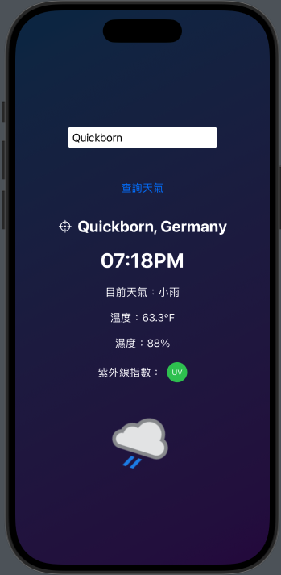
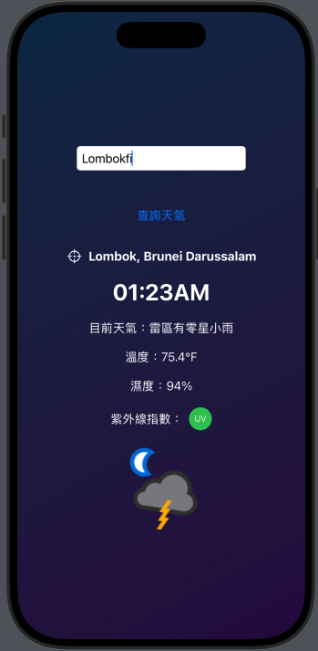
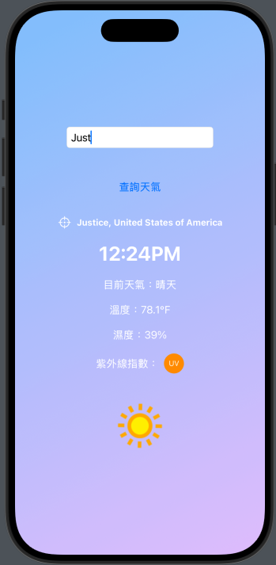
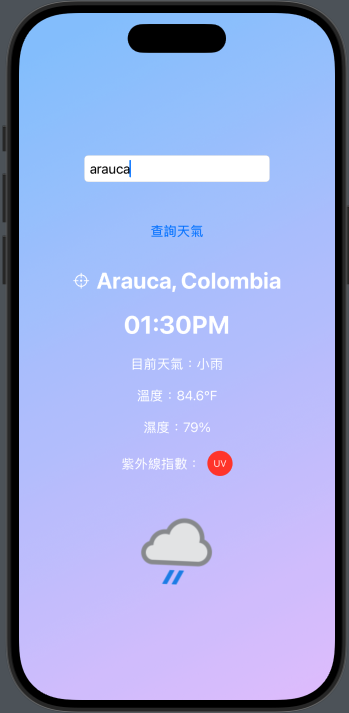
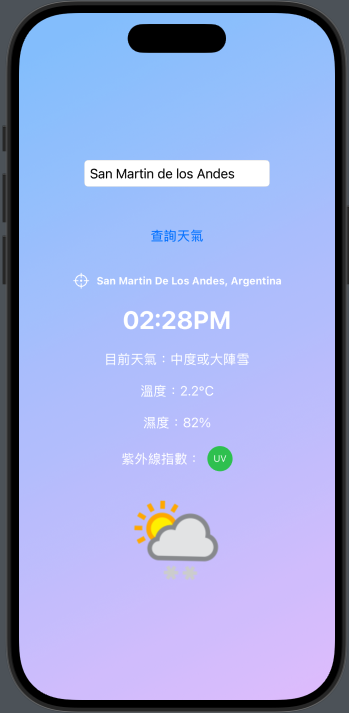

# 行動 APP 天氣查詢專案（MidtermReport）

本專案為 IECS1109 行動 APP 開發課程期中報告作品，採用 SwiftUI 實作，提供即時天氣查詢、顯示地點資訊、濕度、UV 指數與直覺圖示等功能。

## 專案架構

```
MidtermReport/
├── ContentView.swift         # 主畫面，負責 UI 與互動邏輯
├── LocalTimeView.swift       # 地方時間顯示元件
├── WeatherService.swift      # 天氣 API 請求服務
├── WeatherModel.swift        # 天氣資料模型
├── UVIndexIcon.swift         # 紫外線指數分級圖示
├── MidtermReportApp.swift    # App 進入點
MidtermReportTests/
└── MidtermReportTests.swift  # 單元測試（範例）
MidtermReportUITests/
├── MidtermReportUITests.swift        # UI 測試
└── MidtermReportUITestsLaunchTests.swift # 啟動畫面 UI 測試
```

## 主要功能說明

### 1. 天氣查詢與顯示

- 使用者輸入欲查詢的城市名稱，點擊「查詢天氣」按鈕，即可取得並顯示該城市的天氣資訊。
- 顯示內容包括：
  - 城市與國家名稱
  - 當前當地時間（支援 AM/PM 顯示）
  - 天氣現象文字描述
  - 溫度（支援°C/°F切換）
  - 濕度
  - 紫外線指數（UV）：可點擊切換數值與分級顏色圓形圖示
  - 天氣狀態圖標，圖標支援晃動動畫效果

### 2. 介面特色

- 背景漸層色依據目前天氣時段（白天/夜晚）自動切換。
- 文字顏色根據查詢狀態自動調整。
- 查詢過程中會顯示載入動畫（ProgressView）。

### 3. API 與資料模型

- 透過 [WeatherAPI](https://www.weatherapi.com/) 查詢天氣，支援「zh_tw」回傳中文結果。
- `WeatherService.swift`：負責組裝 API 請求、解析回傳 JSON 並轉為 `WeatherResponse` 模型。
- `WeatherModel.swift`：定義天氣資料資料結構，包括地點、當前天氣、濕度、UV 指數等欄位。

### 4. 可維護性與擴展性

- UI 組件（如 UVIndexIcon、LocalTimeView）皆獨立檔案，方便維護與擴充。
- 各種常用功能（如日期時間格式轉換、UV 顏色分級、天氣圖標放大處理）皆封裝於專屬方法。

### 5. 測試

- `MidtermReportTests`：預設 Xcode 單元測試檔案，可擴充測試邏輯。
- `MidtermReportUITests`：包含 App 啟動與基本互動測試。

## 畫面預覽

> 可於 Xcode Simulator 執行後，即時輸入城市查詢天氣，體驗互動式動畫效果。








